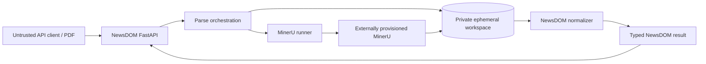

# Architecture

**Protected integration baseline:** `develop` at `2f29e69c99a1201ce6b4e43370a463701efdc81c` when this documentation branch was created.  
**Last reviewed:** 2026-08-09

## Runtime shape

`newsdom-api` is a small service-oriented Python application with a thin FastAPI entrypoint and explicit separation between request orchestration, MinerU process execution, and DOM normalization. MinerU is an explicitly provisioned external runtime boundary; the default API image does not silently become a parser/model distribution.

## Primary modules

- `src/newsdom_api/main.py` exposes `/health` and `/parse` through FastAPI.
- `src/newsdom_api/service.py` orchestrates PDF parsing, temporary files, and response construction.
- `src/newsdom_api/mineru_runner.py` shells out to the MinerU CLI, collects JSON outputs, and translates runtime or incomplete-output failures into typed sanitized exceptions.
- `src/newsdom_api/dom_builder.py` converts MinerU `content_list` blocks plus page model metadata into the canonical NewsDOM response model.
- `src/newsdom_api/schemas.py` defines the public response schema.
- `src/newsdom_api/synthetic.py` and `src/newsdom_api/equivalence.py` support synthetic fixture generation and structural comparisons.

## Request flow

1. `src/newsdom_api/main.py` receives an uploaded PDF.
2. `src/newsdom_api/service.py` writes the upload to a temporary workspace and calls MinerU.
3. `src/newsdom_api/mineru_runner.py` resolves the executable, runs the configured pipeline, loads generated JSON artifacts, and raises typed sanitized errors for runtime-unavailable or incomplete-output cases.
4. `src/newsdom_api/dom_builder.py` normalizes parser blocks into the canonical response while preserving page-aware structure from MinerU model metadata.
5. FastAPI returns typed JSON from `src/newsdom_api/schemas.py` and maps MinerU runtime failures to 503 and incomplete output to 502.

## Runtime authority boundary

Customer PDF bytes and parser output are untrusted data. The sidecar has no authority to interpret document text as system/agent instructions or to mutate a consuming application's private database.

## Health and readiness authority

Protected `develop` currently exposes `/health` as **process liveness**. It does not prove the external MinerU runtime can accept parse traffic and it does not validate a complete `/parse` round trip.

- PR #539 is **active-PR** work for production fail-closed authentication plus a stronger `/ready` traffic-prerequisite contract.
- PR #548 is **active-PR-stacked** work for non-waiting process-local parser admission after the authentication boundary.
- Neither active PR is an as-built protected-branch claim until it is integrated and freshly verified.

## Persistence authority

Protected `develop` owns no durable application database for parse jobs, tenant state, results, or audit. The current request workspace is ephemeral. Hosts may persist returned NewsDOM results under their own authority.

Durable asynchronous parse orchestration is accepted target architecture only. If implemented, NewsDOM owns its job/idempotency/attempt/result/provenance state behind a versioned API; it must not reach into naruon or another consumer's private database. The target data model and worker-fencing/idempotency rules are in `docs/ERD.md` and ADR-0005.

## Supporting systems

- `tests/fixtures` holds synthetic PDFs, JSON baselines, and provenance notes; private reference inputs stay out of git.
- `manual/` is the published user manual rendered by MkDocs.
- `.github/workflows/` encodes CI, security scanning, Pages, release, and image-delivery policy.
- `scripts/release/` builds release manifests and exports GitHub attestation bundles.

## Delivery boundaries

- `develop` is the integration line for normal feature, fix, and chore work.
- `main` is the stable release line that receives tagged releases.
- The service is production-grade only when code, docs, workflows, parser-runtime evidence, and release evidence agree.
- Active PRs, local-only runs, queued checks, or target diagrams never substitute for protected integration evidence.

## Canonical companion documents

- Product requirements: `docs/PRD.md`
- Technical requirements: `docs/TRD.md`
- Runtime/state/authority diagrams: `docs/UML.md`
- Current conceptual + future logical persistence model: `docs/ERD.md`
- Threat model: `docs/THREAT_MODEL.md`
- Test/validity strategy: `docs/TEST_STRATEGY.md`
- Operations/recovery/release: `docs/OPERABILITY.md`
- Requirement/evidence maturity map: `docs/TRACEABILITY.md`
- ADR index: `docs/adr/README.md`
- Canonical documentation map: `docs/engineering/canonical-docs.md`

Changes to authentication/readiness, parser/resource authority, persistent state, durable jobs/idempotency/retry/cancellation, tenant ownership, public schema/versioning, or release/provenance require synchronized updates to this documentation graph rather than a PR-body-only decision.
