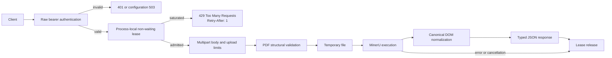

# Architecture

## Runtime shape

`newsdom-api` is a small service-oriented Python application with a thin
FastAPI entrypoint and explicit separation between request security,
process-local admission, MinerU process execution, and DOM normalization. The
same application can run as a standalone service, a sidecar, or a bounded MSA
module behind an API gateway.

## Primary modules

- `src/newsdom_api/main.py` exposes `/health`, `/ready`, and `/parse` through
  FastAPI. Its outer middleware authenticates and admits parser work before the
  multipart body is read.
- `src/newsdom_api/config.py` snapshots immutable runtime authentication,
  profile, executable, and per-process capacity settings during application
  creation.
- `src/newsdom_api/admission.py` owns the process-local non-waiting parser lease
  pool. `ParseAdmissionLimiter` uses `threading.BoundedSemaphore` so excess
  release is treated as a programming error rather than silently inflating
  capacity.
- `src/newsdom_api/service.py` orchestrates PDF parsing and response
  construction.
- `src/newsdom_api/mineru_runner.py` shells out to the MinerU CLI, collects JSON
  outputs, and translates runtime or incomplete-output failures into typed
  sanitized exceptions.
- `src/newsdom_api/dom_builder.py` converts MinerU `content_list` blocks plus
  page model metadata into the canonical NewsDOM response model.
- `src/newsdom_api/schemas.py` defines the public response schema.
- `src/newsdom_api/synthetic.py` and `src/newsdom_api/equivalence.py` support
  synthetic fixture generation and structural comparisons.

## Request flow

1. `src/newsdom_api/main.py` validates the raw Authorization header without
   decoding duplicate or non-ASCII credentials into a lossy string.
2. An authenticated `POST /parse` attempts one lease from
   `ParseAdmissionLimiter` **before the multipart body** is parsed. The attempt
   never waits. Saturation returns `429 Too Many Requests`, `Retry-After: 1`,
   and non-cacheable response headers.
3. The route validates MIME type, form values, declared and streamed size, and
   PDF structure before parser execution.
4. `src/newsdom_api/service.py` and `src/newsdom_api/mineru_runner.py` execute
   MinerU under the configured runtime and error boundaries.
5. `src/newsdom_api/dom_builder.py` normalizes OCR blocks into the canonical
   response while preserving page-aware structure from MinerU model metadata.
6. The outer `finally` boundary releases the parser lease after success,
   validation failure, backend failure, request cancellation, or another
   exception.
7. FastAPI returns typed JSON from `src/newsdom_api/schemas.py` and maps MinerU
   runtime failures to 503 and incomplete output to 502.

## Capacity model

`NEWSDOM_MAX_CONCURRENT_PARSES` is immutable after application creation, accepts
`1..128`, and defaults to `1`. The budget is **per process**, not global. A
single-process replica configured with `N` can execute at most `N` MinerU jobs
at once. A deployment with `R` replicas and one serving process in each has a
nominal upper bound of `R × N`; additional gateway, scheduler, CPU, memory,
VRAM, and storage constraints can reduce effective throughput.

The application intentionally does not wait for a parser slot. An internal
queue would already retain request bodies and open connections, hide overload
from the orchestrator, and make memory consumption proportional to demand.
The fixed 429 contract instead keeps queue ownership at a gateway or durable
job service that can implement tenant policy, persistence, cancellation, and
bounded retry semantics.

## Liveness and readiness

`GET /health` proves only that the web process is live. `GET /ready` proves that
fail-closed authentication configuration and the MinerU executable are
available. Parser saturation does not make a process unready: readiness is a
routing eligibility signal, whereas the admission response is instantaneous
load feedback for each request. A future durable asynchronous job API may add
queue-depth readiness policy without changing this synchronous endpoint's
non-waiting contract.

## Supporting systems

- `tests/fixtures` holds synthetic PDFs, JSON baselines, and provenance notes;
  private reference inputs stay out of git.
- `manual/` is the published user manual rendered by MkDocs.
- `.github/workflows/` encodes CI, security scanning, Pages, release, and
  image-delivery policy.
- `scripts/release/` builds release manifests and exports GitHub attestation
  bundles.
- `docs/doctoring/bounded-parser-admission.md` records the resource-exhaustion,
  HTTP, caching, implementation, rollback, and APA 7 evidence behind the
  admission boundary.

## Delivery boundaries

- `develop` is the integration line for normal feature, fix, and chore work.
- `main` is the stable release line that receives tagged releases.
- The service is production-grade only when code, docs, workflows, and release
  evidence agree.
