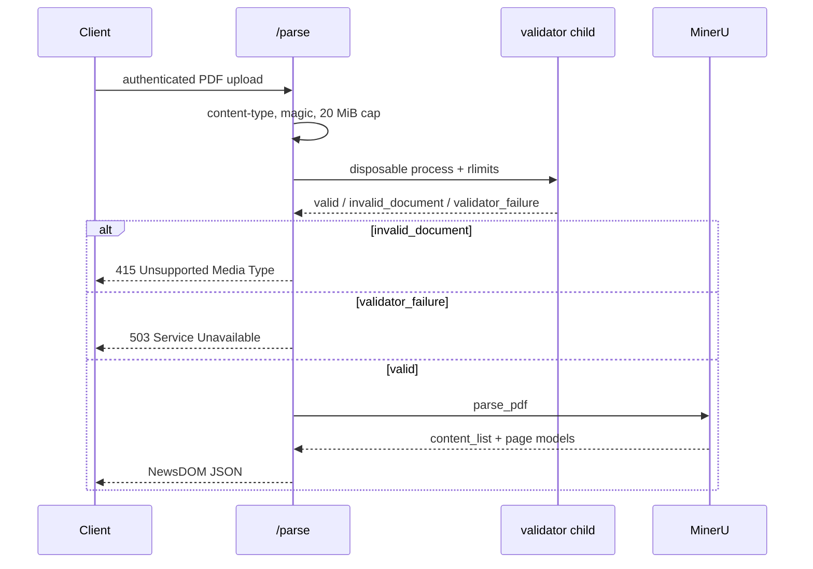

# Architecture

## Runtime shape

`newsdom-api` is a small service-oriented Python application with a
thin FastAPI entrypoint and explicit separation between request
orchestration, MinerU process execution, and DOM normalization.

## Primary modules

- `src/newsdom_api/main.py` exposes `/health` and `/parse`
  through FastAPI.
- `src/newsdom_api/pdf_structure_validator.py` validates an
  uploaded PDF in a disposable Linux child process with CPU,
  address-space, core-dump, process-count, and wall-clock limits
  before MinerU runs. A signal-killed child is an invalid document.
- `src/newsdom_api/service.py` orchestrates PDF parsing,
  temporary files, and response construction.
- `src/newsdom_api/mineru_runner.py` shells out to the MinerU CLI,
  collects JSON outputs, and translates runtime or incomplete-output
  failures into typed sanitized exceptions.
- `src/newsdom_api/dom_builder.py` converts MinerU `content_list`
  blocks plus page model metadata into the canonical NewsDOM response
  model.
- `src/newsdom_api/schemas.py` defines the public response schema.
- `src/newsdom_api/synthetic.py` and
  `src/newsdom_api/equivalence.py` support synthetic fixture
  generation and structural comparisons.

## Request flow

1. `src/newsdom_api/main.py` receives an uploaded PDF and authorizes
   the caller before multipart body reads.
2. The upload is size-bounded and written to a request-scoped
   temporary file. Structural validation then runs in
   `src/newsdom_api/pdf_structure_validator.py` off the ASGI event
   loop.
3. `src/newsdom_api/service.py` calls MinerU only after the isolated
   validator returns `valid`.
4. `src/newsdom_api/mineru_runner.py` resolves the executable, runs
   the OCR pipeline, loads generated JSON artifacts, and raises typed
   sanitized errors for runtime-unavailable or incomplete-output cases.
5. `src/newsdom_api/dom_builder.py` normalizes OCR blocks into the
   canonical response while preserving page-aware structure from
   MinerU model metadata.
6. FastAPI returns typed JSON from `src/newsdom_api/schemas.py` and
   maps invalid structure, timeouts, and signal-killed children to
   415, validator/platform failure to 503, MinerU runtime failures to
   503, and incomplete output to 502.

## Supporting systems

- `tests/fixtures` holds synthetic PDFs, JSON baselines, and
  provenance notes; private reference inputs stay out of git.
- `manual/` is the published user manual rendered by MkDocs.
- `.github/workflows/` encodes CI, security scanning, Pages,
  release, and image-delivery policy.
- `scripts/release/` builds release manifests and exports GitHub attestation bundles.

## Delivery boundaries

- `develop` is the integration line for normal feature, fix,
  and chore work.
- `main` is the stable release line that receives tagged releases.
- The service is production-grade only when code, docs, workflows,
  and release evidence agree.
