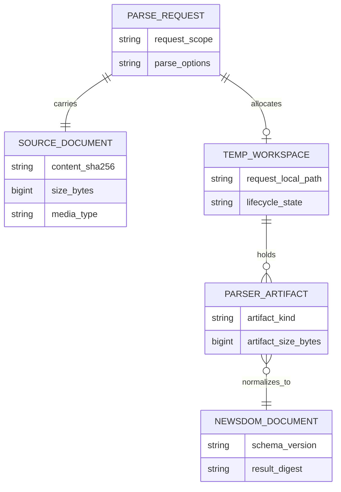
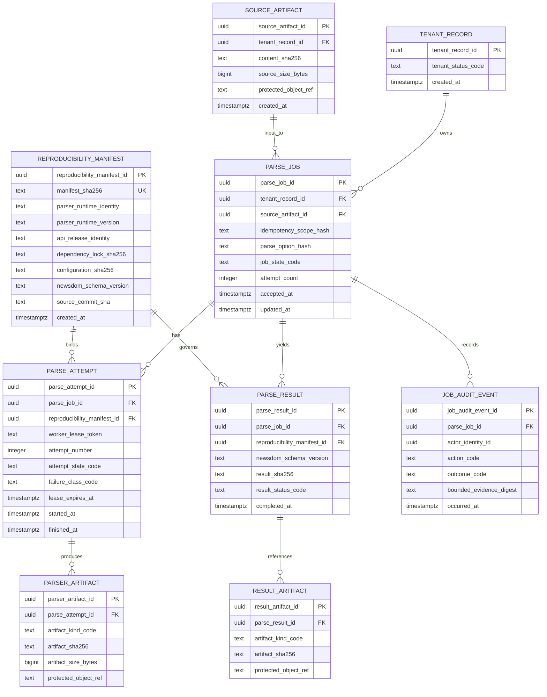

# NewsDOM API Logical and Persistence ERD

**Status:** Accepted logical baseline. Protected `develop` owns no durable application database.  
**Last reviewed:** 2026-08-09

## Current persistence truth

The protected synchronous service writes a PDF and parser outputs into a private temporary workspace for one request, returns typed NewsDOM JSON, and cleans the workspace. It does **not** own durable parse-job, tenant, audit, or artifact database tables. Host products may persist returned data under their own authority.

These are conceptual current-runtime entities, not tables.

## Accepted-target durable job model — not implemented

## Naming and identity invariants

Owned persistent objects use descriptive two-or-more-word `snake_case`. Public/job IDs are opaque UUIDs, never sequential authorization tokens.

Logical uniqueness for the target includes:

- `(tenant_record_id, idempotency_scope_hash)` for one accepted logical submission scope;
- `(parse_job_id, attempt_number)` for attempt ordering;
- immutable digest identity for source/parser/result artifacts;
- a partial unique constraint on `(parse_job_id, reproducibility_manifest_id)`
  where `result_status_code = 'succeeded'`, allowing at most one immutable
  successful result per exact accepted job contract; a versioned reparse uses
  a new manifest/contract identity and explicit successor relationship.

`idempotency_scope_hash` binds principal/tenant, caller idempotency key, source
digest, parse options, public API/schema version, and parser runtime/model
contract identity and version. It is not derived from source digest alone
because the same source may be intentionally parsed under different options or
contract versions.

## Job-state invariant

Target job-state transitions are closed and forward-governed. `succeeded`, `cancelled`, and `quarantined` are terminal for one attempt lifecycle; replay creates a new attempt under explicit policy rather than mutating historical attempt evidence into success.

## Lease/fencing invariant

A durable worker attempt may publish state/result only while holding the current fencing/lease authority for the job. Expired/stale workers cannot overwrite a later attempt's result. Process-local semaphores from PR #548 are not a substitute for this durable target.

## Artifact and provenance invariant

A parse result binds:

- exact source digest;
- exact parser runtime identity/version;
- NewsDOM schema version;
- parse-option/configuration digest;
- dependency lock and producing release/commit identity;
- result digest and protected artifact reference.

Audit events are bounded operational evidence and do not replace the reproducibility manifest.

## Tenant/privacy invariant

All durable source/result/artifact records are tenant-scoped and require purpose-bound authorization. General logs/metrics store bounded digests/classifications rather than raw PDF/extracted text. Deletion/retention must cover source and derived protected artifacts without rewriting immutable audit facts falsely.

## Migration acceptance

This target becomes physical only with reviewed migrations/rollback, indexes/constraints, tenant/RLS or equivalent authorization, idempotency/concurrency/lease tests, cancellation/replay, backup/restore, retention/deletion, artifact-store recovery, and exact-head security/coverage evidence. Until then this is conceptual/accepted-target, not a protected-branch database claim.
