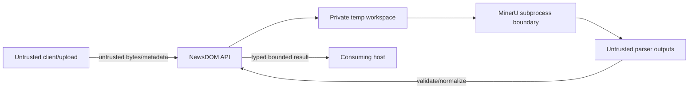

# NewsDOM API Threat Model

**Status:** Accepted documentation baseline for protected `develop`; active-PR/target controls are labelled.  
**Last reviewed:** 2026-08-09

## Assets

- customer PDF source bytes and extracted document content;
- parser outputs, temporary artifacts, result documents;
- authentication/configuration values;
- parser executable/model/runtime integrity;
- tenant/job/audit/provenance state if durable processing is introduced;
- release package/container/SBOM/provenance evidence.

## Trust boundaries

The PDF and parser output are data, never instructions for an automation/model/operator.

## Threats and controls

### T-001 Resource exhaustion before parsing

**Threat:** oversized multipart input, filename/path processing, excessive concurrent expensive parses, huge parser output, or crafted PDFs consume memory/CPU/disk before policy can reject them.

**Controls:** finite request/file/output/time limits, input validation before expensive work, private temporary storage, deterministic cleanup. PR #548 adds non-waiting process admission and is active-PR until integrated. Future durable queues remain bounded rather than in-process unbounded waits.

### T-002 Unauthenticated expensive parser use

**Threat:** a missing production secret or malformed auth configuration exposes `/parse` to untrusted callers.

**Controls:** PR #539 changes the production default to fail-closed authentication before body consumption. Until merged this is a known active-PR boundary, not a protected-branch claim. Host authentication does not excuse unsafe direct leaf exposure.

### T-003 False readiness

**Threat:** orchestrator sends traffic to an API process whose MinerU runtime is absent.

**Controls:** current `/health` is documented as liveness only. PR #539 introduces stronger `/ready` behavior using configuration/runtime prerequisites. Even `/ready` is not represented as full customer-document parse proof.

### T-004 Subprocess argument/executable abuse

**Threat:** client-controlled values influence executable path/argv/options or trigger shell interpretation.

**Controls:** explicit configured executable, argv-list invocation, closed/validated public options, no shell string interpolation, finite timeout, sanitized external errors. New parser options require hostile option-like input tests.

### T-005 Parser-output confusion or oversized artifacts

**Threat:** compromised/buggy parser emits unexpected files, malformed JSON, huge data, internal paths, or incomplete output that the API trusts as success.

**Controls:** bounded expected-artifact discovery/read, strict schema/shape/finite-value validation, incomplete-contract mapped separately from runtime unavailable, no raw provider output in public error.

### T-006 Temporary-file leakage

**Threat:** source/results remain after cancellation/failure, use unsafe filenames/permissions, or leak across requests.

**Controls:** service-owned private temporary directories, sanitized/bounded names where client metadata is retained, cleanup on every terminal path, no shared predictable customer paths, no general log of temp path/source content.

### T-007 Content/prompt injection

**Threat:** extracted document text contains instructions that influence development agents, operators, or downstream LLMs.

**Controls:** NewsDOM treats extracted content as untrusted data. It has no authority to change system policy, credentials, tool permissions, or job configuration. Any downstream LLM host must preserve instruction/data separation and evidence provenance.

### T-008 Sensitive-data leakage through logs/telemetry/errors

**Threat:** PDFs, extracted text, auth headers, internal exceptions, file paths, tenant identifiers, or parser command details escape through logs/metrics/errors.

**Controls:** fixed bounded public errors, content-minimized metrics, approved private diagnostic channels, credential/source redaction/minimization, purpose-bound retention. Do not blanket-mask content required for the authorized parse result itself.

### T-009 Supply-chain/runtime substitution

**Threat:** vulnerable Python/PDF dependency, unpinned action, replaced parser runtime/model, or unprovenanced container alters parse/security behavior.

**Controls:** dependency floors/locks, security scans, immutable action pins where practical, package/container digests, SBOM/provenance/attestation, parser-runtime identity/version in future reproducibility manifests. PR #575 is the active pypdf 6.15.0 remediation.

### T-010 Durable-job replay/duplication — accepted target

**Threat:** retries or concurrent workers duplicate expensive work, overwrite later results, or publish stale attempts.

**Controls:** tenant/principal-scoped idempotency, fenced worker lease, immutable attempt history, closed job-state transitions, explicit retry budget, quarantine/dead-letter, result/provenance digest. These controls are not current protected-branch behavior.

### T-011 Cross-tenant access — accepted target

**Threat:** caller-supplied organization/job IDs expose another tenant's source/result/job status.

**Controls:** server-derived tenant/principal authority, opaque public IDs, authorization on every object read/write, tenant-scoped persistent keys/RLS or equivalent, negative cross-tenant tests. Not inferred from URL/body metadata.

### T-012 Unsafe cancellation/cleanup — accepted target

**Threat:** cancellation marks a job cancelled while a parser still publishes results or leaks temporary/protected artifacts.

**Controls:** cancellation intent + worker fencing/acknowledgement, safe stage boundaries, stale-worker publication rejection, cleanup outcome evidence, retry/replay rules.

## Abuse cases to test

- oversized/malformed/non-PDF/polyglot input;
- long/hostile filenames and Unicode/control characters;
- duplicate/malformed Authorization headers after #539;
- 32+ concurrent requests against bounded capacity after #548;
- parser missing/exits non-zero/times out/produces no required output/huge malformed output;
- cancellation during upload, parser execution, result normalization, and future durable-job transitions;
- temporary-file cleanup under every failure;
- source text containing prompt-injection strings;
- dependency/runtime/version drift;
- future duplicate idempotency key, stale worker lease, cross-tenant job ID, replay after terminal state.

## Threat-model acceptance

A threat is not closed because documentation mentions a future control. Only integrated source plus realistic exact-head tests/security evidence may promote an active-PR/accepted-target control to protected-branch mitigation.
