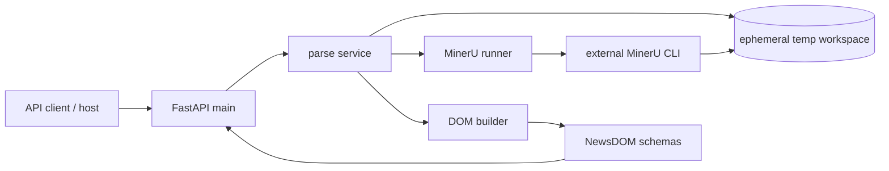
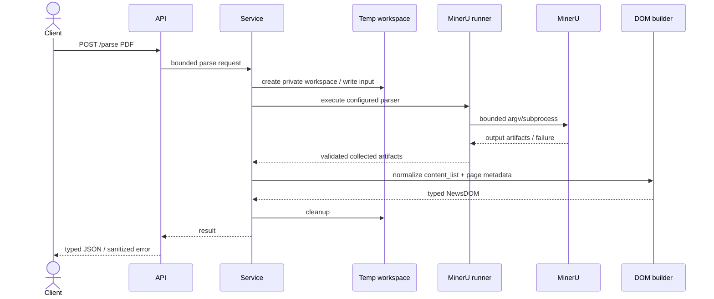
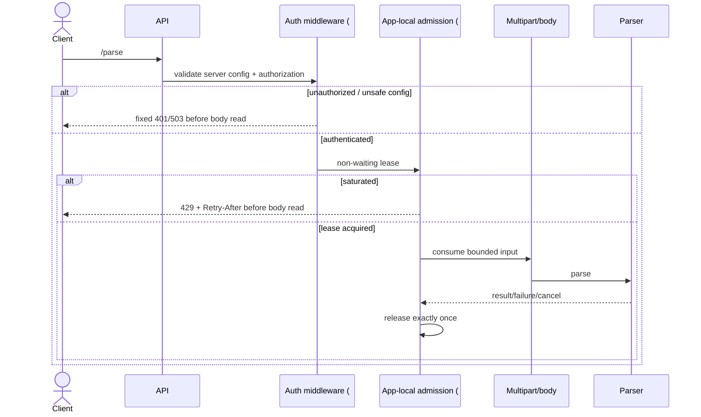
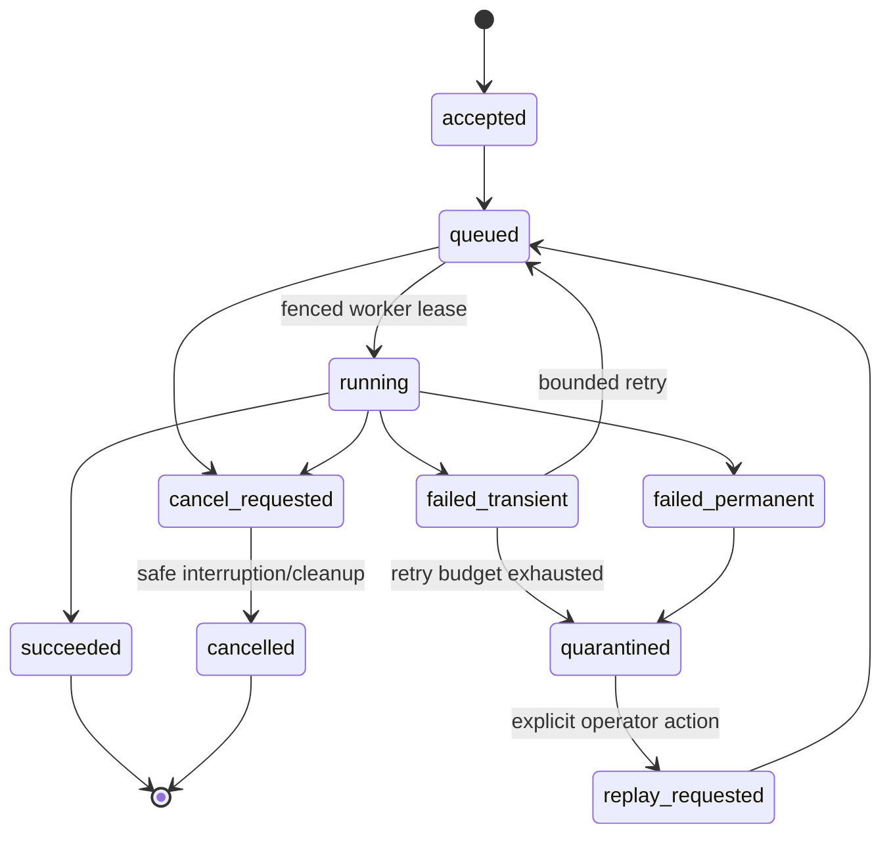
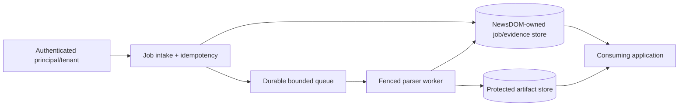
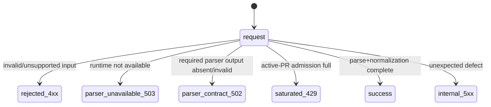
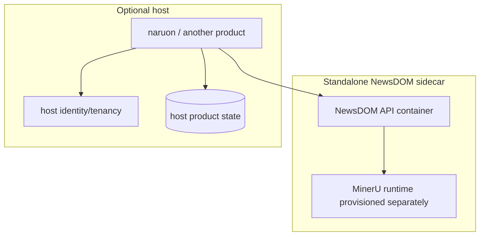

# NewsDOM API UML and Runtime Views

**Status:** Accepted documentation baseline; active-PR and accepted-target boundaries are labelled.  
**Last reviewed:** 2026-08-09

## Protected-develop component view



## Current synchronous parse sequence



## Liveness/readiness view

```mermaid
flowchart TB
    PROCESS[FastAPI process]
    HEALTH[/health — protected-develop liveness]
    AUTH[required auth configuration — PR #539]
    EXEC[MinerU executable — PR #539 readiness input]
    READY[/ready — PR #539 active-PR]
    FULL[full customer-document parse]

    PROCESS --> HEALTH
    AUTH -. active-PR .-> READY
    EXEC -. active-PR .-> READY
    READY -. prerequisite, not proof .-> FULL
```

`/health` must not be documented as proof that parse traffic is usable.

## Authentication + admission sequence — active PRs



This sequence becomes as-built only as its implementing PRs land in dependency order.

## Durable job state machine — accepted target, not implemented



No current synchronous request is a durable job merely because this target is documented.

## Durable job authority view — accepted target



NewsDOM-owned durable state, if introduced, remains behind a versioned API; the service never reaches into a consuming product's private database.

## Failure classes



## Deployment view



The host can add stronger policy and workflow but does not erase the leaf parser's own resource/input/runtime boundary.

## Maintenance rule

Update these views whenever authentication/readiness, parser execution, public schema, persistence, job state, tenant authority, retry/cancellation, or deployment ownership changes. `active-PR` and `accepted-target` views must not be relabelled as protected-branch behavior before integration and exact-head evidence.
