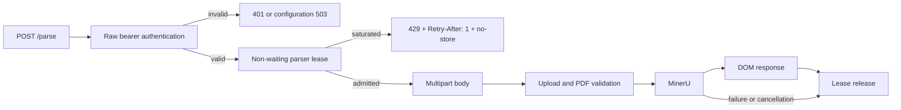

# Bounded parser admission

## Decision

NewsDOM applies a process-local, non-waiting concurrency boundary to the
expensive synchronous `/parse` path. The immutable setting
`NEWSDOM_MAX_CONCURRENT_PARSES` accepts an integer from `1` through `128` and
defaults to `1`.

An authenticated request must acquire one parser lease before FastAPI or
Starlette parses the multipart body, before request bytes are copied to a
temporary file, before PDF structure validation, and before MinerU is invoked.
If no lease is available, the service immediately returns:

```http
HTTP/1.1 429 Too Many Requests
Retry-After: 1
Cache-Control: no-store, no-cache, max-age=0
```

The service does not wait for a lease and does not create an in-process upload
queue.

## Buyer-visible problem

MinerU parsing can consume substantial CPU, memory, temporary storage, and GPU
resources. Without an admission boundary, a short request burst can begin many
multipart reads and parser processes at once. The resulting resource
competition can increase latency, trigger out-of-memory termination, exhaust
writable volumes, and make every request fail rather than rejecting only excess
work.

OWASP API4:2023 identifies unrestricted consumption of CPU, memory, process,
payload, and third-party resources as an API availability and cost risk. The
control implemented here limits active parser work rather than relying on
client goodwill or a best-effort timeout after resources have already been
allocated.

## Boundary ordering

The access path is deliberately ordered as follows:



Authentication precedes admission so unauthenticated traffic cannot consume a
parser lease or infer capacity from overload responses. Admission precedes
multipart parsing so rejected work does not retain request bodies, allocate
request-scoped temporary files, validate PDFs, or enter MinerU.

## HTTP semantics

RFC 6585 defines `429 Too Many Requests` for request-rate or overload controls
and permits a `Retry-After` response field. NewsDOM uses an exact one-second
hint because the synchronous API has no durable queue position or completion
estimate. Clients should still use bounded jitter and stop retrying according
to their own deadline.

RFC 6585 also states that 429 responses must not be stored by a cache. RFC 9111
provides the `no-store` response directive. NewsDOM applies `Cache-Control:
no-store, no-cache, max-age=0` through the same security-header middleware used
for every parser response, preventing an intermediary from replaying a stale
overload decision after capacity has recovered.

The response body is fixed and does not reveal the configured capacity, current
lease count, parser identity, queue depth, file metadata, internal paths, or
another tenant's activity.

## Implementation

`src/newsdom_api/admission.py` contains `ParseAdmissionLimiter`. Each FastAPI
application owns one limiter. The implementation uses
`threading.BoundedSemaphore` because the protected work executes through a
thread-backed synchronous parser boundary and requests may arrive from multiple
threads or event-loop tasks.

`BoundedSemaphore` also treats release beyond the configured initial value as a
programming error. This is preferable to silently increasing capacity after a
double release.

The middleware follows this invariant:

```text
authenticate
→ try_acquire without waiting
→ call downstream application
→ release in finally
```

The `finally` boundary returns the lease after a successful response, form or
PDF validation failure, MinerU runtime failure, incomplete MinerU output,
unhandled exception, or request cancellation. Authentication and service
configuration failures occur before acquisition and therefore do not require a
release.

## Scope and MSA behavior

The capacity is **per process**. It is not an organization-wide, cluster-wide,
repository-wide, or tenant-wide counter. If a replica has `P` serving processes
and each process is configured with `N`, that replica can nominally run at most
`P × N` parser jobs. With `R` identical replicas, the nominal deployment ceiling
is `R × P × N`.

Actual safe capacity can be lower because pods share CPU, memory, storage,
model caches, and sometimes a GPU. A gateway may add identity-aware request
rates, quotas, fairness, and circuit breaking. A future durable job service may
own persistent queueing and cancellation. Neither layer should remove this
last-resort process boundary.

The module remains usable independently in the standalone NewsDOM service and
when NewsDOM is imported as a sidecar or MSA component. It does not require a
shared database, distributed lock, Redis, or naruon runtime.

## Configuration and deployment

The conservative production default is:

```text
NEWSDOM_MAX_CONCURRENT_PARSES=1
```

The setting is parsed once during application creation and remains immutable.
Changing the environment of a running process does not resize the active
limiter. Operators must restart the serving process after an approved change.

The repository-owned Docker Compose and Kubernetes examples explicitly set the
value to `1`. The Kubernetes example has two replicas, so it advertises two
nominal active parses while retaining independent failure domains.

Raise the value only after measuring representative PDFs across the expected
size, page-count, language, OCR mode, and document-complexity distribution.
Record at least:

- peak resident memory and, when applicable, peak VRAM;
- temporary-volume peak usage;
- p50, p95, and p99 parser latency;
- timeout, 429, 502, 503, and process-crash rates;
- output accuracy and structural-equivalence metrics;
- behavior when one replica is terminating or unavailable.

Prefer additional replicas when one MinerU process already consumes a large
share of a pod's memory or GPU budget.

## Verification evidence

The regression suite proves:

- immutable direct and environment configuration with a default of one;
- rejection of blank, non-integer, boolean, zero, and values above 128;
- application-local rather than global lease state;
- immediate saturation without a body read or downstream call;
- fixed 429 body, exact `Retry-After: 1`, and no-store response headers;
- lease recovery after success, exception, and cancellation;
- authentication failure without lease consumption;
- a realistic burst of 32 requests with capacity four, admitting four and
  rejecting the remaining 28;
- OpenAPI publication of the 429 response;
- production deployment examples and operator documentation;
- 100% production statement and branch coverage and public docstrings.

A live deployment acceptance test should additionally hold all configured
leases at the MinerU boundary, send one excess authenticated request, verify no
new temporary file or parser process is created, release one request, and prove
the next request is admitted.

## Failure handling

Unexpected 429 growth means the service is protecting itself. Operators should
inspect traffic composition, parser duration, replica health, CPU, RSS, VRAM,
temporary storage, and downstream dependencies before raising the limit.
Readiness should remain a dependency and security signal; ordinary short-lived
saturation does not make the process permanently unready.

A leaked lease would reduce capacity until process restart. The test suite
covers every current response and cancellation path, while
`BoundedSemaphore` detects over-release. Monitoring should alert on sustained
429 rate, falling successful throughput, parser duration, and replica restart
rate rather than exposing internal lease counts to unauthenticated callers.

## Rollback

Rollback must preserve authentication, upload limits, and non-waiting
admission. Reduce `NEWSDOM_MAX_CONCURRENT_PARSES` to the last accepted value and
restart processes so the immutable setting is reloaded. If a release regression
is suspected, restore the previous verified image digest together with its
recorded capacity.

Before reopening traffic, verify `/health`, `/ready`, one successful
authenticated parse, one intentional saturated 429, and successful admission
after the held request releases its lease. Do not roll back to an unbounded or
default-open parser.

## Limitations and next slices

This boundary does not provide durable asynchronous processing, tenant
fairness, distributed capacity, priority scheduling, or a job status and
cancellation API. Those capabilities belong in a separately bounded job
service. The synchronous endpoint intentionally exposes overload instead of
pretending to queue work it cannot persist or recover.

## References

Fielding, R., Nottingham, M., & Reschke, J. (2022). *HTTP caching* (RFC
9111). Internet Engineering Task Force. https://doi.org/10.17487/RFC9111

Nottingham, M., & Fielding, R. (2012). *Additional HTTP status codes* (RFC
6585). Internet Engineering Task Force. https://doi.org/10.17487/RFC6585

OWASP Foundation. (2023). *API4:2023 unrestricted resource consumption*.
*OWASP API Security Top 10*.
https://owasp.org/API-Security/editions/2023/en/0xa4-unrestricted-resource-consumption/

Python Software Foundation. (2026). *threading—Thread-based parallelism
(Python 3.10.20 documentation)*.
https://docs.python.org/3.10/library/threading.html
