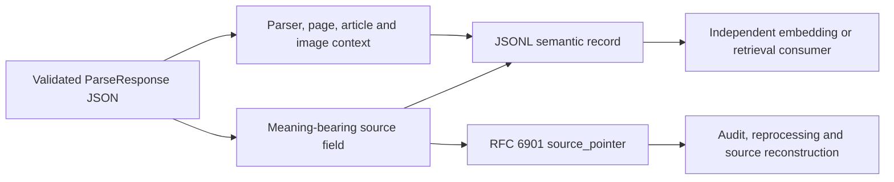

# Provenance-preserving semantic flattening for retrieval

## Delivery status

- **Status:** Active pull request; not shipped from protected `develop` or `main`.
- **Scope:** `tools/flatten_dom.py` converts one validated `ParseResponse` JSON document into ordered JSONL records.
- **Out of scope:** Embedding generation, vector-database writes, model selection, OCR or object recognition of image bytes, retrieval ranking, and claims of RAG quality improvement.
- **Supersession rule:** This document becomes shipped truth only after the exact integrated head passes repository policy and merges. Until then, protected-branch documentation remains authoritative.

## Buyer-visible problem

A naïve one-dimensional export can discard the evidence needed to answer: “Which source value produced this retrieved text?” It can also separate image-derived text from the image asset that gave the text meaning. That makes search results difficult to inspect, cite, delete, or reprocess safely.

The bounded slice therefore preserves existing NewsDOM semantic boundaries rather than inventing fixed-size chunks. It emits separate records for page headers, visible page numbers, section headings, body blocks, article captions and footnotes, advertisement text, page footers, and image-linked captions or footnotes. Empty source values are not emitted as artificial chunks.

Research does not justify claiming that every semantic chunker improves retrieval. Controlled evidence reports inconsistent gains relative to simpler approaches, while other evaluations find that document segmentation can improve retrieval and downstream question answering. The product contract is consequently conservative: preserve meaning-bearing source units and provenance now, then evaluate downstream splitting, merging, prefixing, and embedding strategies with task-specific ablations before adopting them as defaults (Qu et al., 2025; Wang et al., 2025).

## Traceability contract

Each JSONL record contains:

- `document_id`, `page_number`, page dimensions, and parser status;
- optional `article_id` plus article geometry;
- `type` and `source_kind`, distinguishing ordinary text from searchable image-linked text;
- `source_pointer`, an RFC 6901 JSON Pointer to the exact source value;
- deterministic `record_index` and source-local `content_index`;
- optional caption geometry, image path, image media type, and image geometry.

The pointer identifies the source entity within the validated JSON document. The surrounding identifiers and geometry record the derivation context needed to audit or reconstruct a retrieved unit. This is a deliberately small application profile of the W3C PROV principle that provenance should describe entities and their derivations; it is not a claim that the JSONL record itself is a complete PROV-O serialization.

## Image evidence boundary

The current canonical schema stores extracted image references and associated captions or footnotes; it does not carry embedded base64 image bytes or object-recognition results. The flattener therefore emits existing image captions and footnotes as separate `source_kind=image_text` records while retaining `image_path`, media type, image bounding box, and caption bounding box.

A later image-recognition slice must add a versioned schema for OCR/object labels, model provenance, confidence, retention, and authorization before such evidence can be indexed. The current tool must not fabricate recognition evidence from an image path alone.

## Failure and durability contract

Input is rejected before flattening when it is missing, has a non-JSON extension, is malformed JSON, or fails the canonical `ParseResponse` schema. Expected customer input and filesystem failures produce one actionable CLI error; unexpected implementation defects retain their traceback for operators.

File output is written to a sibling temporary file, flushed, synchronized, and atomically replaced. A serialization or replacement failure leaves an existing complete output unchanged and removes the temporary file. Standard output remains one compact JSON object per line.

## Acceptance evidence required before merge

- realistic current-schema fixture covering page, article, image, caption, footnote, and empty-field paths;
- exact pointer and ordering assertions;
- source, parser, geometry, and image-provenance assertions;
- atomic-success and atomic-failure tests;
- exact 100% owned statement and branch coverage for the production module;
- repository formatting, typing, docstring, security, dependency, and review gates on one unchanged head;
- no downstream retrieval-quality claim without a separately specified corpus, queries, relevance judgments, baselines, and ablations.

## References

Bryan, P. C., Zyp, K., & Nottingham, M. (2013). *JavaScript Object Notation (JSON) Pointer* (RFC 6901). Internet Engineering Task Force. https://doi.org/10.17487/RFC6901

Lebo, T., Sahoo, S., & McGuinness, D. (Eds.). (2013). *PROV-O: The PROV ontology* (W3C Recommendation). World Wide Web Consortium. https://www.w3.org/TR/prov-o/

Qu, R., Tu, R., & Bao, F. S. (2025). Is semantic chunking worth the computational cost? In L. Chiruzzo, A. Ritter, & L. Wang (Eds.), *Findings of the Association for Computational Linguistics: NAACL 2025* (pp. 2155–2177). Association for Computational Linguistics. https://doi.org/10.18653/v1/2025.findings-naacl.114

Wang, Z., Gao, C., Xiao, C., Huang, Y., Si, S., Luo, K., Bai, Y., Li, W., Duan, T., Lv, C., Lu, G., Chen, G., Qi, F., & Sun, M. (2025). Document segmentation matters for retrieval-augmented generation. In W. Che, J. Nabende, E. Shutova, & M. T. Pilehvar (Eds.), *Findings of the Association for Computational Linguistics: ACL 2025* (pp. 8063–8075). Association for Computational Linguistics. https://doi.org/10.18653/v1/2025.findings-acl.422
