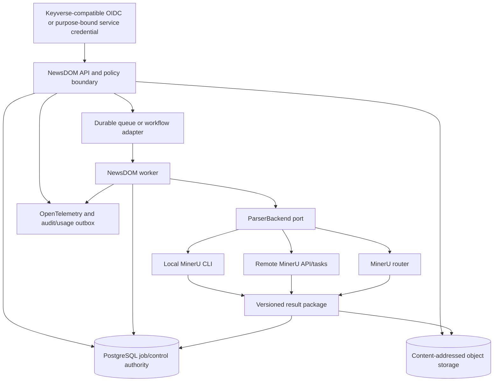

# NewsDOM API Product and Technical Gap Baseline

**Status:** Proposed commercial-readiness baseline  
**Snapshot date:** 2026-08-20  
**Protected source line:** `develop@e06b1f3fb10903569124af011da213951e6e2473`  
**Current package/API version:** `0.2.0`  
**Tracking issue:** [#670 — Complete NewsDOM API and consolidate the 52-PR delivery queue](https://github.com/ContextualWisdomLab/newsdom-api/issues/670)

## 1. Purpose and authority

This document is the repository-local source of truth for the gap between the
currently shipped NewsDOM API and a commercially complete document-intelligence
product.

It serves five purposes:

1. preserve current product truth without promoting unmerged pull requests;
2. identify buyer-visible product gaps and their technical root causes;
3. map every gap to an issue, implementation boundary, and verification gate;
4. keep the live pull-request queue inside the completion analysis;
5. define the evidence required before a release can be described as production
   ready.

This document does **not** claim that NewsDOM is complete, universally accurate,
or ready for regulated use. A passing unit-test and coverage gate is necessary
engineering evidence, not proof of extraction validity on representative customer
documents.

When this document conflicts with shipped code, the protected branch code is the
runtime truth and this baseline must be corrected. When this document conflicts
with an unmerged PR description, this document and the protected branch take
precedence until the PR is integrated.

## 2. Executive decision

NewsDOM already has a credible hardened sidecar foundation:

- language-selectable PDF-to-DOM parsing through MinerU;
- a typed FastAPI response model;
- fail-closed bearer authentication for `/parse`;
- distinct `/health` liveness and `/ready` traffic-readiness probes;
- bounded upload size and temporary-file cleanup;
- sanitized parser error responses;
- production statement and branch coverage gates at 100%;
- public docstring auditing, fuzzing, security scanning, packaging, and release
  provenance.

The product is not commercially complete because the current synchronous request
path does not provide a durable job or result lifecycle, media references can point
to deleted temporary artifacts, table structure is flattened, extraction fidelity
is not yet validated on a representative release-blocking corpus, identity and
operations remain sidecar-level rather than enterprise-level, and the delivery
queue contains many competing implementations of the same behavior.

The completion sequence is:

```text
M0  consolidate the PR queue and integrate current security/resource boundaries
M1  make the result package lossless, retrievable, versioned, and benchmarked
M2  add durable asynchronous jobs, persistence, idempotency, cancellation, replay
M3  add tenant identity, fair limits, telemetry, audit, SLOs, and recovery evidence
M4  complete licensing, ecosystem adapters, procurement evidence, and release
```

## 3. Evidence basis

| Evidence | Protected-branch finding | Maturity |
| --- | --- | --- |
| `README.md` | Positions NewsDOM as a MinerU-backed PDF-to-DOM sidecar; documents auth, liveness/readiness, API-only and NVIDIA images | shipped |
| `ARCHITECTURE.md` | Defines a thin synchronous FastAPI → temporary workspace → MinerU CLI → DOM normalization flow | shipped |
| `pyproject.toml` | Version `0.2.0`, Python `>=3.10,<3.14`, 100% branch/statement coverage contract | shipped |
| `src/newsdom_api/main.py` | Static bearer auth, 20 MiB protected-branch limit, synchronous validation, synchronous `/parse` response | shipped |
| `src/newsdom_api/service.py` | Copies source into a temporary directory and returns before the directory is removed | shipped |
| `src/newsdom_api/mineru_runner.py` | Invokes MinerU CLI, reads generated JSON, and deletes its temporary output directory after return | shipped |
| `src/newsdom_api/schemas.py` | Typed pages/articles/images/captions, but no structured table model or durable artifact contract | shipped |
| `src/newsdom_api/dom_builder.py` | Returns media paths and flattens table bodies into article text blocks | shipped |
| PR #577 | Attempts a canonical PRD/TRD/API/UML/ERD baseline, but is conflicted and contains maturity assertions superseded by protected code | unmerged/stale |
| GitHub PR inventory | 52 open PRs at snapshot time, including several overlapping implementation families | operational blocker |
| Issues #534, #604, #624, #641 | Existing performance, workflow-lifecycle, parser-isolation, and docs-auth gaps | open |
| Issues #666–#671 | Durable jobs, lossless results, validity, enterprise operation, completion roadmap, and commercial compliance | open |

## 4. Current product truth

### 4.1 Runtime flow

```mermaid
flowchart LR
    C[Authenticated caller] --> P[POST /parse]
    P --> U[Stream upload to temporary file]
    U --> V[pypdf structural validation]
    V --> T[asyncio.to_thread]
    T --> S[parse_pdf service]
    S --> M[MinerU 3.4.4 CLI]
    M --> J[Temporary content_list/model JSON]
    J --> D[DOM builder]
    D --> R[Inline ParseResponse JSON]
    R --> X[Temporary workspaces deleted]
```



The current API is intentionally small and useful as a bounded sidecar. It is not
a durable document-processing control plane.

### 4.2 Shipped HTTP surfaces

| Surface | Current contract | Commercial implication |
| --- | --- | --- |
| `GET /health` | process liveness only | must remain weaker than readiness |
| `GET /ready` | auth configuration and MinerU executable availability | safe routing probe, not an SLO or end-to-end parse test |
| `POST /parse` | authenticated multipart PDF, inline synchronous result | suitable for bounded compatibility work, not large durable workflows |

The protected branch accepts a maximum of 20 MiB. PR #665 proposes 64 MiB to
match Naruon, but the commercial value is not the larger constant by itself. Any
increase must be reconciled with #534 admission, concurrency, memory, and temporary
disk evidence.

### 4.3 Authentication truth

Production authentication is a single configured bearer secret. It is fail closed
and compares credentials in constant time, which is a strong sidecar boundary.
It does not identify a tenant, end user, service principal, purpose, project, or
cost center. It therefore cannot support tenant isolation, per-principal policy,
auditable usage attribution, or enterprise federation on its own.

### 4.4 Parser and dependency truth

The product contract and optional NVIDIA image use `mineru[pipeline]==3.4.4`.
The default image omits MinerU, while the optional NVIDIA image installs it.
Upstream MinerU has evolved beyond a single local CLI: it provides multiple parser
backends and an asynchronous task/router surface. NewsDOM should preserve its own
stable contract while adapting to approved upstream execution modes rather than
exposing mutable MinerU task or model identifiers directly to customers.

### 4.5 Result truth

The current response preserves page groupings, headings, body text, image/chart
metadata, captions, footnotes, bounding boxes, warnings, and some page metadata.

Two confirmed buyer-visible gaps remain:

1. `ImageNode.path` can describe a MinerU-relative file that is no longer
   retrievable after temporary workspaces are deleted.
2. table content is appended to `body_blocks`; row, cell, span, header, geometry,
   and cross-page relationships are not public typed data.

The current `document_id` is based on a sanitized temporary filename stem. It is
not a content identity, idempotency identity, or durable result identity.

### 4.6 Quality truth

The repository has strong code-quality evidence:

- 100% production statement coverage;
- 100% production branch coverage;
- public API docstring audit;
- unit and integration-style tests;
- hostile input and fuzzing targets;
- dependency, SAST, CodeQL, Scorecard, container, and release workflows;
- synthetic fixtures with provenance notes.

The missing evidence is representative extraction validity. The release process
does not yet block a parser/model upgrade that degrades reading order, table cells,
formulas, captions, a particular script, or real-world captured pages while leaving
unit tests green.

## 5. Gap register

| Gap ID | Priority | Buyer-visible problem | Root cause | Tracking |
| --- | ---: | --- | --- | --- |
| ND-GAP-001 | P0 | One malformed PDF can consume unbounded validator resources | `PdfReader` runs synchronously without child-process CPU/memory/wall-clock isolation | [#624](https://github.com/ContextualWisdomLab/newsdom-api/issues/624), PR #632 |
| ND-GAP-002 | P0 | Concurrent uploads can exhaust memory, disk, event-loop, or parser capacity | no benchmarked upload/admission/fairness contract | [#534](https://github.com/ContextualWisdomLab/newsdom-api/issues/534), PR #633/canonical successor |
| ND-GAP-003 | P0 | Delivery is slow and contradictory despite extensive work | 52 open PRs, with multiple duplicate implementation families | [#670](https://github.com/ContextualWisdomLab/newsdom-api/issues/670) |
| ND-GAP-004 | P0 | Operators see orphaned historical workflow identities | removed one-shot YAML left active Actions registry records | [#604](https://github.com/ContextualWisdomLab/newsdom-api/issues/604) |
| ND-GAP-005 | P0 | Swagger re-authentication is repetitive, but persistent bearer storage expands risk | no bounded docs-specific re-auth flow | [#641](https://github.com/ContextualWisdomLab/newsdom-api/issues/641) |
| ND-GAP-006 | P1 | Returned image/chart references can be unusable after the request | response exposes temporary MinerU-relative paths without an artifact service | [#667](https://github.com/ContextualWisdomLab/newsdom-api/issues/667) |
| ND-GAP-007 | P1 | Tables cannot be reconstructed or audited reliably | table HTML/text is flattened into article strings | [#667](https://github.com/ContextualWisdomLab/newsdom-api/issues/667) |
| ND-GAP-008 | P1 | Clients cannot reason safely about schema evolution or parser provenance | no explicit result schema version, content hash, model revision, or result manifest | [#667](https://github.com/ContextualWisdomLab/newsdom-api/issues/667) |
| ND-GAP-009 | P1 | Accuracy claims are not supported by representative customer-document evidence | synthetic/code-path tests are not a multi-level extraction benchmark | [#668](https://github.com/ContextualWisdomLab/newsdom-api/issues/668) |
| ND-GAP-010 | P2 | Long jobs cannot be polled, cancelled, retried, replayed, or recovered | only synchronous request-scoped execution exists | [#666](https://github.com/ContextualWisdomLab/newsdom-api/issues/666) |
| ND-GAP-011 | P2 | Duplicate submissions can repeat expensive parser work | no tenant/principal-scoped idempotency or durable source/result identity | [#666](https://github.com/ContextualWisdomLab/newsdom-api/issues/666) |
| ND-GAP-012 | P2 | Worker/process failure can lose all state and output | no PostgreSQL job authority, object store, fencing, or atomic result publication | [#666](https://github.com/ContextualWisdomLab/newsdom-api/issues/666) |
| ND-GAP-013 | P3 | Enterprise buyers cannot isolate tenants or federate identity | one static bearer secret has no tenant/principal/purpose semantics | [#669](https://github.com/ContextualWisdomLab/newsdom-api/issues/669) |
| ND-GAP-014 | P3 | Operators cannot locate latency, saturation, or parser-stage failures | no OpenTelemetry traces/metrics or SLO evidence | [#669](https://github.com/ContextualWisdomLab/newsdom-api/issues/669) |
| ND-GAP-015 | P3 | Usage, audit, and commercial attribution are not durable | logs are not a business audit/usage ledger | [#669](https://github.com/ContextualWisdomLab/newsdom-api/issues/669) |
| ND-GAP-016 | P1/P4 | Bundled image procurement and redistribution evidence is incomplete | NewsDOM MIT, MinerU custom license/additional conditions, model/runtime terms need profile-specific review | [#671](https://github.com/ContextualWisdomLab/newsdom-api/issues/671) |
| ND-GAP-017 | P4 | Ecosystem consumers can couple to transient implementation details | no released durable job/result/artifact SDK contract | #666, #667, #669 |
| ND-GAP-018 | P4 | Architecture truth is split across protected code and an unmerged conflicted documentation PR | PR #577 has not been reconciled with current code | #577 and this baseline |

## 6. Live PR baseline and consolidation plan

At snapshot time, GitHub reported **52 open pull requests**. A high PR count is not
a completion metric. Several families implement the same outcome repeatedly,
sometimes with different constants or stale base commits.

### 6.1 Canonicalization families

| Family | Representative PRs | Required action |
| --- | --- | --- |
| DOM filtering CLI | #573, #601, #616, #623, #629, #639, #650, #655, #663 | select one current-base compositional/schema-validated implementation; absorb unique tests; close the rest as superseded |
| upload chunk-size changes | #608, #612, #618, #627, #636, #646, #653, #658 | do not merge a constant-only change; resolve through #534 benchmark and admission budget |
| dictionary micro-optimization | #574, #615, #619, #628, #637, #649, #654, #659 | retain only measured changes that preserve error semantics; close claim-only duplicates |
| form-field length limits | #625, #634, #645, #652, #661 | choose one exact contract with early-body and Unicode/hostile-input tests |
| MinerU output directory | #656, #662 | retain one implementation with deterministic fallback and differentiated errors |
| OpenAPI examples | #598, #613, #664 | keep plural OpenAPI examples and remove deprecated/singular overlap |
| parser admission | #548, #633 | select one current-base lane; predecessor checks/reviews do not transfer |
| canonical product docs | #577 | rebase or supersede stale maturity assertions; do not merge conflicted history as current truth |

### 6.2 PRs that represent distinct product slices

The following representative work is not automatically duplicate and should be
reviewed as its own public contract:

- #594 — provenance-preserving flat JSONL/RAG projection;
- #599 — authoritative sanitized HTTP-exception handling;
- #607 — browser/API security headers;
- #632 — structural validator process isolation;
- #633 — parser admission/backpressure candidate;
- #657 — pinned dependency-action updates;
- #665 — Naruon-aligned upload ceiling, contingent on #534 resource evidence.

### 6.3 Consolidation rules

```text
1. bind inventory to the exact protected develop SHA;
2. compare each PR against current develop and every overlapping PR;
3. select one current-base canonical lane per buyer outcome;
4. add a failing test before absorbing unique behavior;
5. preserve no predecessor checks, reviews, or approvals as current-head evidence;
6. close superseded PRs only with a specific replacement link and rationale;
7. run exact-head tests, security checks, and independent review;
8. merge, then refresh the inventory before choosing the next lane.
```

Micro-optimization PRs must include a reproducible benchmark on the actual hot
path. A shorter expression or fewer Python bytecodes is not evidence of a
customer-visible improvement.

## 7. Target product architecture



### 7.1 Deployment profiles

| Profile | Purpose | Persistence | Parser runtime |
| --- | --- | --- | --- |
| `standalone_sync` | local developer/small bounded sidecar | temporary only | local approved CLI |
| `standalone_durable` | single-node customer deployment | PostgreSQL + local/S3-compatible artifacts | local approved CLI |
| `distributed_worker` | production queue/workers | PostgreSQL + object store | local CLI per worker |
| `remote_parser` | separate parser fleet or GPU service | NewsDOM authority + object store | MinerU API/tasks/router adapter |

Every profile must implement the same public result and authorization contract.
The standalone profile must remain independently useful; the distributed profile
must not force all product logic into one monolith.

## 8. Target public contracts

### 8.1 Compatibility API

```text
POST /parse
```

Keep this endpoint for bounded synchronous use. It must use the same validation,
policy, result schema, artifact publication, provenance, and benchmarked parser
profile as durable processing. It cannot acquire fictional retry, replay, or
idempotency guarantees.

### 8.2 Durable API

```text
POST   /v1/parse-jobs
GET    /v1/parse-jobs/{parse_job_id}
POST   /v1/parse-jobs/{parse_job_id}/cancel
GET    /v1/parse-jobs/{parse_job_id}/result
POST   /v1/parse-jobs/{parse_job_id}/replay
GET    /v1/artifacts/{artifact_id}
```

A durable submission returns `202 Accepted` and a monitor link. Terminal result
publication is atomic. Repeated requests use tenant/principal-scoped idempotency.

### 8.3 Result package

The target result must include:

```text
schema_version
result_manifest_id
document_content_sha256
parser_backend
parser_version
parser_model_revision
parser_configuration_hash
created_at
source_page_count
pages / sections / blocks / tables / media
artifact_manifest
quality_profile
provenance_reference
```

Public responses contain no host-local or temporary path.

### 8.4 Persistence model

The minimum 3NF control model is:

```text
parse_job
parse_request
parse_attempt
parser_backend
backend_job_mapping
result_manifest
artifact_record
job_state_transition
idempotency_record
worker_lease
identity_assignment
audit_event
usage_event
outbox_event
inbox_event
```

All database object names contain at least two `snake_case` words. Partitioning
must distribute tenant/time load and avoid one mutable hot partition.

## 9. Accuracy and benchmark contract

The representative benchmark in #668 is a release gate, not a marketing sample.
It must evaluate:

| Layer | Evidence |
| --- | --- |
| text | script-aware character/word accuracy and normalized edit distance |
| layout | category precision/recall/F1 and bounding-box overlap |
| reading order | ordered-block or pairwise order accuracy |
| headings | hierarchy and section association |
| tables | TEDS, row/cell/span, cell text, cross-page continuity |
| formulas | normalized/exact expression accuracy |
| media | image/chart detection and caption/footnote association |
| provenance | source-pointer and geometry completeness/accuracy |
| robustness | scan, skew, warp, screen photo, illumination, compression |
| performance | p50/p95 latency, throughput, CPU, RSS, VRAM, disk, result bytes |

Results are stratified by language, document class, capture condition, parser
backend, model revision, and device. A high aggregate score cannot conceal a
material failure in one customer profile.

## 10. Verification matrix

| Quality property | Required evidence |
| --- | --- |
| code correctness | unit, property, integration, E2E, statement/branch coverage 100% |
| public comprehension | public API/model/state docstrings 100% |
| untrusted input | fuzzing, malformed MIME/PDF/JSON, hostile Unicode/path/header tests |
| resource safety | child-process limits, admission, timeout, cancellation, disk/memory budgets |
| idempotency | same request 100 times → one job/result/billable execution |
| fencing | concurrent workers cannot publish duplicate terminal results |
| durability | queue/process/object-store failure and restart recovery |
| cancellation | late backend result cannot overwrite cancelled state |
| tenancy | cross-tenant job/result/artifact access 0 |
| identity | JWT issuer/audience/signature/time/key-rotation tests |
| artifacts | SHA-256 verified retrieval; no local paths; expiry renewal |
| result fidelity | representative benchmark thresholds and paired regression report |
| parser upgrades | exact package/model/runtime manifest and before/after evidence |
| observability | one trace across API/queue/worker/parser/result; bounded metrics |
| privacy | no document content, secret, private filename, or PII in telemetry |
| backup/restore | clean restore with job/result/audit reconciliation |
| release | SBOM, notices, checksums, signed provenance, rollback rehearsal |
| documentation | PRD/TRD/API/UML/ERD/threat/test/operability/CHANGELOG agree |

## 11. Milestone plan

### M0 — Delivery and safety baseline

**Outcome:** one canonical PR per outcome and a safe bounded synchronous service.

- integrate #624/#632 validator isolation;
- resolve #534 and choose canonical admission/upload behavior;
- resolve #604 and #641;
- consolidate duplicate PR families;
- reconcile or supersede #577;
- maintain exact-head required checks and independent review.

**Exit:** open PR inventory is small, unique, current-base, and reviewable; no
known unbounded validation/admission path remains.

### M1 — Lossless and valid result

**Outcome:** every result remains usable, verifiable, and accuracy-qualified.

- implement #667 result manifest, durable artifacts, structured tables, schema
  versioning, and provenance;
- implement #668 representative benchmark and release thresholds;
- bind backend/model/license profile through #671;
- add generated client fixtures and deprecation contract.

**Exit:** media is retrievable, tables are structured, every result identifies its
parser/model/configuration, and the released profile passes the full benchmark.

### M2 — Durable processing

**Outcome:** customers can safely submit, poll, cancel, recover, and replay work.

- implement #666 API/state/idempotency contracts;
- add PostgreSQL/object-store authority;
- implement worker leases/fencing and atomic result publication;
- provide local CLI and remote MinerU API/router adapters;
- rehearse crash, queue outage, cancellation, late result, backup, and restore.

**Exit:** no accepted job is lost and duplicate requests do not duplicate work.

### M3 — Enterprise operation

**Outcome:** tenant-isolated, observable, auditable service with measurable SLOs.

- implement #669 identity/authorization/fairness;
- add W3C Trace Context and OpenTelemetry spans/metrics;
- add append-only audit and durable unsampled usage events;
- publish dashboards, alerts, error budgets, runbooks, and capacity baseline.

**Exit:** operators can identify saturation/failure stages without document access,
and tenant policy is enforced at every job/result/artifact boundary.

### M4 — Ecosystem and commercial release

**Outcome:** supportable, procurable, modular NewsDOM product.

- complete #671 distribution/licensing profiles, notices, SBOM, and model/runtime
  governance;
- release SDKs/adapters for Naruon, Clearfolio, LineageWeave, Semantic Data Portal,
  and contextual-orchestrator through public contracts;
- publish support, compatibility, deprecation, security-advisory, and data-residency
  policies;
- perform release, rollback, disaster recovery, and procurement evidence rehearsal.

**Exit:** a buyer can deploy, integrate, audit, upgrade, roll back, and obtain support
without relying on repository history or maintainer memory.

## 12. Ecosystem ownership boundaries

| Product | NewsDOM integration | Prohibited coupling |
| --- | --- | --- |
| Naruon | submit signed/deferred attachments; poll job/result | direct NewsDOM DB access; separate upload-size truth |
| Clearfolio | durable preview/result/artifact consumer | treating transient paths as preview assets |
| LineageWeave | consume evidence-bearing blocks and provenance | promoting inferred lineage into parser truth |
| TEPP | consume temporal/source-grounded text units | direct parser implementation dependency |
| Semantic Data Portal | catalog result schemas, provenance, and governed assets | copying all customer documents into catalog metadata |
| contextual-orchestrator | interpret verified evidence bundles | modifying parser truth or accepting web/document instructions as system policy |
| Billing Control Plane | receive durable quantitative usage events | deriving charges from sampled telemetry or document content |
| Keyverse | OIDC/service identity and federation | direct access to Keyverse credentials/database |

## 13. Commercial release gate

A release is not commercially complete unless all statements below are true.

### Product

- [ ] bounded synchronous compatibility and durable asynchronous workflows work;
- [ ] status, cancellation, retry, replay, retention, and result retrieval are explicit;
- [ ] media/table/formula outputs are usable and traceable after the request;
- [ ] schema compatibility and deprecation rules are published;
- [ ] every buyer-facing failure provides a safe next action.

### Accuracy

- [ ] representative real and synthetic truth corpus is versioned and licensed;
- [ ] text/layout/order/table/formula/media/provenance thresholds pass;
- [ ] parser/backend/model/device evidence matches the release artifact;
- [ ] CPU/GPU/backend parity and resource results are published;
- [ ] no skipped or missing benchmark lane is treated as success.

### Security and privacy

- [ ] structural validation and parser execution are resource isolated;
- [ ] tenant/principal/purpose authorization covers job/result/artifact APIs;
- [ ] credentials, document contents, private filenames, and local paths are absent
      from logs, traces, metrics, audit broadcasts, and usage events;
- [ ] hostile input, SSRF/network, archive/model acquisition, and supply-chain
      boundaries are tested;
- [ ] disclosure and incident-response procedures identify affected profiles.

### Reliability and operations

- [ ] duplicate request, worker race, timeout, crash, cancellation, queue outage,
      partial publish, backup, and restore tests pass;
- [ ] SLOs, error budgets, capacity limits, alerts, and runbooks are current;
- [ ] one trace correlates API, queue, worker, parser, normalization, and publication;
- [ ] result, artifact, audit, and usage ledgers reconcile after recovery.

### Engineering and release

- [ ] production statement coverage 100%;
- [ ] production branch coverage 100%;
- [ ] public docstring coverage 100%;
- [ ] exact-head required checks are terminal successful;
- [ ] valid review threads are resolved and current-head independent approval exists;
- [ ] SBOM, third-party notices, checksums, signed provenance, and reproducible build
      manifest exist for every distribution profile;
- [ ] PRD, TRD, API, UML, ERD, threat, test, operability, CHANGELOG, manual, and this
      baseline agree with the shipped release.

## 14. Explicit non-goals

The completion program does not require NewsDOM to:

- reimplement MinerU models or scheduling internals;
- become an LLM interpretation or knowledge-graph product;
- own customer identity credentials;
- own billing calculations;
- support every document format or language before profile-specific validation;
- hide parser uncertainty behind one success flag;
- become a monolith that absorbs Naruon, Clearfolio, LineageWeave, TEPP, or the
  Semantic Data Portal;
- claim formal certification merely because a standard was used as a design input.

## 15. Update protocol

Update this document in the same PR whenever any of the following changes:

- a gap is completed, split, invalidated, or superseded;
- a protected API/schema/state transition changes;
- a parser/backend/model profile is added, upgraded, or retired;
- a release benchmark threshold changes;
- a new persistent data object or service ownership boundary is introduced;
- a current PR becomes the canonical lane or is closed as superseded;
- a security, operability, licensing, or procurement requirement changes.

Every update records the new protected-branch SHA and preserves links to the issue,
ADR, implementation, test evidence, and release where the change became true.

## 16. References — APA 7th

Internet Engineering Task Force. (2022). *HTTP semantics* (RFC 9110). RFC
Editor. https://www.rfc-editor.org/rfc/rfc9110

National Institute of Standards and Technology. (2022). *Secure software
development framework (SSDF) version 1.1: Recommendations for mitigating the
risk of software vulnerabilities* (NIST SP 800-218).
https://csrc.nist.gov/publications/detail/sp/800-218/final

OpenDataLab. (2026). *MinerU: Transforms complex documents into LLM-ready
Markdown/JSON*. GitHub. https://github.com/opendatalab/MinerU

OpenTelemetry Authors. (2026). *Semantic conventions for HTTP metrics*.
https://opentelemetry.io/docs/specs/semconv/http/http-metrics/

Ouyang, L., Qu, Y., Zhou, H., Zhu, J., Zhang, R., Lin, Q., Wang, B., Zhao, Z.,
Jiang, M., Zhao, X., Shi, J., Wu, F., Chu, P., Liu, M., Li, Z., Xu, C., Zhang,
B., Shi, B., Tu, Z., & He, C. (2025). OmniDocBench: Benchmarking diverse PDF
document parsing with comprehensive annotations. In *Proceedings of the
IEEE/CVF Conference on Computer Vision and Pattern Recognition* (pp.
24838–24848).
https://openaccess.thecvf.com/content/CVPR2025/html/Ouyang_OmniDocBench_Benchmarking_Diverse_PDF_Document_Parsing_with_Comprehensive_Annotations_CVPR_2025_paper.html

SPDX Workgroup. (2025). *SPDX specification*. Linux Foundation.
https://spdx.github.io/spdx-spec/

Wang, B., Xu, C., Zhao, X., Ouyang, L., Wu, F., Zhao, Z., Xu, R., Liu, K., Qu,
Y., Shang, F., Zhang, B., Wei, L., Sui, Z., Li, W., Shi, B., Qiao, Y., Lin, D.,
& He, C. (2024). *MinerU: An open-source solution for precise document content
extraction*. arXiv. https://arxiv.org/abs/2409.18839

World Wide Web Consortium. (2013). *PROV-O: The PROV ontology*.
https://www.w3.org/TR/prov-o/

World Wide Web Consortium. (2021). *Trace Context*.
https://www.w3.org/TR/trace-context/

Zhou, C., Gao, Z., Wang, X., Gao, T., Cui, C., Tang, J., & Liu, Y. (2026).
*Real5-OmniDocBench: A full-scale physical reconstruction benchmark for robust
document parsing in the wild*. arXiv. https://arxiv.org/abs/2603.04205
